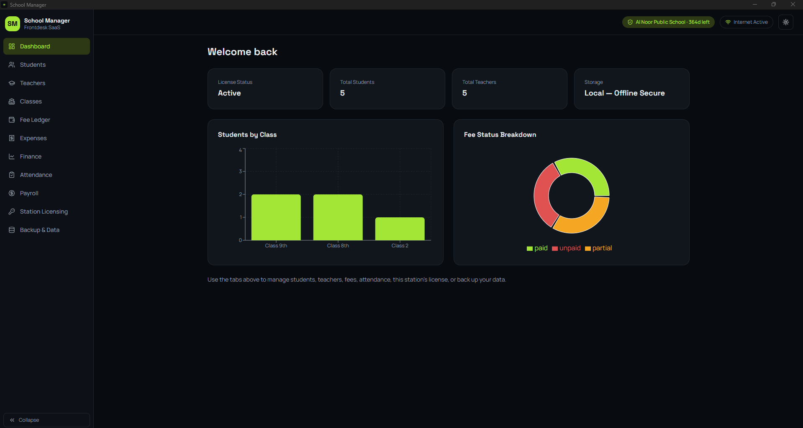

# School Manager — Offline Desktop SaaS (React + Tailwind + Tauri)

Offline-first school management desktop app: a local JSON data file (no native
database driver needed), per-table CSV/Excel
import/export, a full JSON backup/restore, a 7-day free trial, and a
**hardware-locked** 1-year license system — with light/dark mode.

## Two builds from one codebase — read this first

This project produces **two different .exe files**:

| Build | Who runs it | Contains license generator? |
|---|---|---|
| **School Edition** (`build:school`) | Every school you sell to | ❌ No — physically excluded at build time |
| **Creator Edition** (`build:creator`) | Only you, on your own PC | ✅ Yes — the "Creator Licensing Admin Panel" |

This matters because the license generator needs your private signing key.
Shipping it inside a school's copy — even hidden behind a password — would let
a technical person extract it and mint unlimited free licenses. Instead, Vite
is configured (`vite.config.ts`) to swap the real `CreatorAdminPanel.tsx` for
an empty stub whenever you build the School Edition, so that code never exists
in the shipped installer at all. This has been verified: `grep` across a school
build's output finds zero trace of the signing logic.

**Never send a Creator Edition build to a school. Only ever send School Edition.**

## Prerequisites (once, on your Windows dev machine)

1. [Node.js](https://nodejs.org) LTS
2. [Rust](https://www.rust-lang.org/tools/install)
3. Tauri prerequisites for Windows (MSVC Build Tools + WebView2): https://v2.tauri.app/start/prerequisites/

## First-time setup

```bash
npm install
npm run generate-keypair
```

This prints a **public key** — paste it into `src/license/license.ts`,
replacing `REPLACE_WITH_YOUR_PUBLIC_KEY`. It also writes
`license-signing-key.PRIVATE.json` — back this up somewhere safe (password
manager / encrypted drive). Anyone with this file can generate valid licenses.
It's git-ignored by default and is only ever read by the Creator Edition.

## Run while developing

Important: this is a **desktop app**, not a website. Always use the `tauri:dev:*`
commands below — they open the real native app window. Never open
`http://localhost:1420` directly in a normal browser tab; that page has no
access to your database, files, or hardware ID (Tauri's native bridge only
exists inside the actual app window), so the app will just hang on
"Checking license…" forever.

```bash
npm run tauri:dev:school     # Launches the real app window — School Edition UI
npm run tauri:dev:creator    # Launches the real app window — Creator Edition UI (includes the admin panel)
```

Use `tauri:dev:creator` while you're developing/testing so you can see and use
the admin panel yourself. `tauri:dev:school` shows you exactly what a school
will see (no admin panel).

## Build the shareable .exe

```bash
npm run build:school     # → send this installer to schools
npm run build:creator    # → keep this one, for yourself only
```

Output installer (both editions build to the same path, one at a time):
`src-tauri/target/release/bundle/nsis/School Manager_0.1.0_x64-setup.exe`

> **Important:** close any running copy of the app (check Task Manager for
> `school-manager.exe` if it's not obviously open) *before* running the other
> edition's build — School and Creator share the same output path, and Windows
> won't let Cargo overwrite a `.exe` that's currently running. If you build
> School, test it, then immediately try to build Creator without closing the
> School app first, you'll get `Access is denied`.
>
> (We previously tried giving each edition its own `CARGO_TARGET_DIR` to avoid
> this entirely — don't do that. It breaks Tauri's own dev-mode file watcher,
> which doesn't reliably learn about a relocated target directory, causing an
> infinite rebuild loop that never finishes and consumes tens of GB of disk
> space. Closing the running app before switching editions is the correct fix.)

> Build on Windows (or a `windows-latest` GitHub Actions runner) — cross-compiling
> Tauri's Windows bundler from Linux/Mac isn't reliable.

## Licensing workflow (hardware-locked, works fully offline)

1. School installs the **School Edition** and opens it. A 7-day free trial
   starts automatically (all features unlocked, no key needed).
2. They open **Station Licensing** on each PC they want to use and see that
   PC's **Device Hardware ID** (e.g. `SCH-HW-4AF901`) — derived from its
   hardware, via a Tauri Rust command (`get_hardware_id`). They send you the
   ID(s) + payment.
3. You open the **Creator Edition** on your own PC → **Station Licensing** →
   **Creator Licensing Admin Panel** → load your private key file → enter the
   school's name, pick a **Station Plan** (1-Station / 3-Station / Unlimited),
   enter a hardware ID per station (skip this for Unlimited), and an expiry
   date → **Generate Activation Key**. You get a short key like
   `SCH-4F8A2B-91C3D0-...`.
4. You send that **same key** to the school. Each authorized PC pastes the
   identical key into **Activation Key** on its own Station Licensing screen
   and presses **Activate & Lock Station**. A 3-Station key activates on all
   three of the PCs whose hardware IDs you entered — an unlisted 4th PC is
   rejected. An Unlimited key activates on any PC (no hardware check at all;
   this trades some anti-copy protection for flexibility, so use it for
   trusted enterprise customers).
5. From then on, each station verifies the key **entirely offline** (Ed25519
   signature check against your public key, baked into the School Edition) —
   no internet needed day-to-day. If they copy the app/database to a different
   PC, the hardware ID won't match and it locks itself automatically.

To renew: generate a new key with the same Hardware ID and a new expiry date,
send it over, they paste it again.

There's also a CLI alternative if you'd rather not open the Creator Edition
GUI: `node scripts/generate-license.mjs "School Name" SCH-HW-XXXXXX 2027-07-24`

## What's included

- **Data layer** (`src/db/db.ts`) — a single JSON file on disk
  (`school-data.json`, in the app's local data folder), loaded into memory on
  startup and written back on every change. No native database driver, no
  SQL — just `getAll`, `insertRow`, `updateRow`, `deleteRow`, `upsertRow`, and
  `getStore()` for the rare cross-table join/aggregation (used by Fees,
  Attendance, and the Dashboard charts).
- **Students / Teachers / Fees / Attendance modules** (`src/pages/`) — CRUD +
  CSV/Excel import/export. Copy the Students.tsx pattern for any new module.
- **WhatsApp Fee Reminders** (`src/lib/whatsapp.ts`, `src/components/WhatsAppReminderModal.tsx`)
  — a "Send Reminder" button on Fee Ledger's unpaid/partial rows and on
  Finance's Fee Defaulters tracker composes a message (editable template in
  Settings → School Profile) and offers **WhatsApp Desktop** (via the
  `whatsapp://` OS protocol handler, using `tauri-plugin-shell`) or
  **WhatsApp Web** (opens `wa.me` in the default browser), plus Copy
  Message/Copy Number as a manual fallback. Phone numbers are normalized from
  common local formats (`0300-1234567`, `+92...`) to the international format
  WhatsApp links require, defaulting to Pakistan's country code.
  > Note: I couldn't test the actual `whatsapp://` launch against a real
  > Windows + WhatsApp Desktop install in my build environment. If it doesn't
  > open on your machine, the Copy Message/Copy Number buttons still work as
  > a manual fallback — see `src-tauri/capabilities/default.json`'s
  > `shell:allow-open` scope if it needs adjusting.
- **ID Cards** (`src/components/IDCardModal.tsx`) — printable student/teacher
  ID cards with 4 built-in designs (Classic Banner, Vertical Portrait, Minimal
  Stripe, Bold Diagonal), switchable at print time. Upload a photo on any
  Student or Teacher (`src/lib/photo.ts`) — stored as a base64 data URL
  directly in that record (included in JSON backups automatically). No photo
  uploaded → the card falls back to a placeholder avatar instead of breaking.
- **Exams & Results** (`src/pages/Exams.tsx`, `src/components/ReportCardModal.tsx`)
  — create an exam scoped to one class (name, date, subjects picked from the
  same managed Subjects list Teachers uses, each with its own Max/Pass marks),
  enter every student's marks in a spreadsheet-style grid, and print a report
  card per student. Totals, percentage, grade, and pass/fail are **computed on
  the fly** from `getGrade()`/`summarizeExamResult()` in `src/db/db.ts` —
  never stored, so they can never drift out of sync with the raw marks. A
  student must pass every subject's individual pass-marks to pass overall.
  Default grade scale: A+ 90+, A 80+, B 70+, C 60+, D 50+, E 33+, F below —
  edit `GRADE_BANDS` in `db.ts` if your school uses a different scale.
- **Payroll & Teacher Salaries** (`src/pages/Payroll.tsx`) — base salary per
  teacher, monthly processing with deduction auto-suggested from Attendance's
  Teacher mode (absent/leave days), and printable payslips. Marking a salary
  "Paid" auto-creates a matching row in Expenses under **"Payroll / Salaries"**;
  editing or un-marking it keeps that Expenses row in sync (updates or removes
  it) instead of leaving duplicates or orphans — this logic lives entirely in
  `saveSalary()` / `deleteSalary()` in `src/db/db.ts`. **Never call
  insertRow/updateRow/deleteRow("salaries", ...) directly** — always go
  through those two functions, or the linked Expenses row can go out of sync.
- **Feature-flag licensing** (`src/license/licenseFormat.ts` — `FEATURE_KEYS`)
  — each license you issue enables a specific set of modules (checkboxes in
  the Creator Admin Panel). The sidebar and page content both check
  `isFeatureEnabled()` in `src/App.tsx`. To add a new gate-able module: add its
  key to `FEATURE_KEYS`/`FEATURE_LABELS`, then tag its `NAV_ITEMS` entry with
  `feature: "yourKey"`.
- **Station Licensing** (`src/pages/StationLicensing.tsx`) — hardware ID
  display, activation key input, explanation card, and (Creator Edition only)
  the license generator panel.
- **Backup & Data** (`src/pages/Settings.tsx`):
  - **Full Backup (JSON)** — one restorable file with every table's data.
  - **Restore From Backup** — replaces all data after confirmation.
  - **Export All as CSV** — one .csv per table, for opening in Excel.
  - **Automatic Backups** (`src/lib/autoBackup.ts`) — a dated backup
    (`backup-YYYY-MM-DD.json`) is created silently the first time the app
    opens each day, stored in `<app-local-data>/backups/`. Only the most
    recent N are kept (default 10, editable in Settings) — older ones are
    deleted automatically. Deliberately **decoupled from the main data
    store** (retention count lives in its own `backups/config.json`, not in
    `school-data.json`) so backups keep working even if the main store ever
    gets corrupted — that's the whole point of a backup system. Restore or
    delete any individual day's backup from Settings.
- **Trial + license gate** (`src/App.tsx`) — 7-day trial banner, then locks
  down to the activation screen until a valid key is entered.
- **Light/dark theme toggle** (`src/theme/ThemeProvider.tsx`) — persisted
  locally, toggled from the top bar.
- **Online/offline indicator** in the top bar — cosmetic status for now; the
  app never actually requires internet to function.

## Adding a new module (e.g. Classes)

1. Add the type + array to `AppData` in `src/db/db.ts`, and add the table
   name to the `TABLES` constant there.
2. Copy `src/pages/Students.tsx` → `src/pages/Classes.tsx`, adjust fields/table name.
3. It's automatically included in backups (`BACKUP_TABLES` is just `TABLES`).
4. Add a nav tab for it in `src/App.tsx`.

## App icon

Before your first build:

```bash
npm run tauri icon path/to/your-logo.png
```
